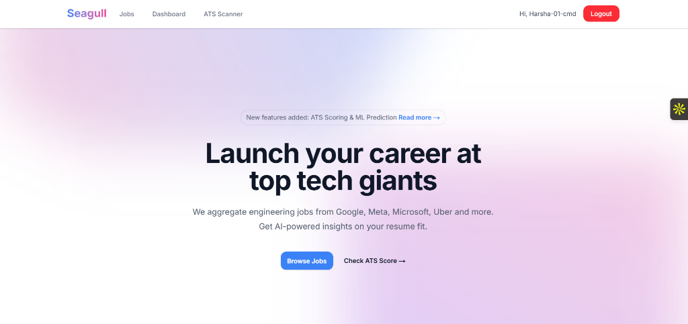
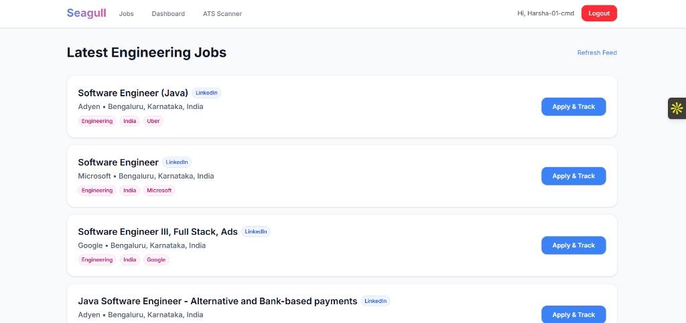
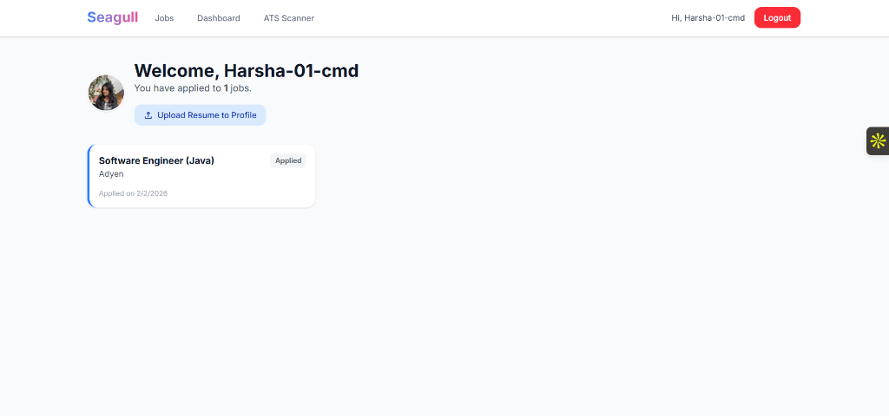
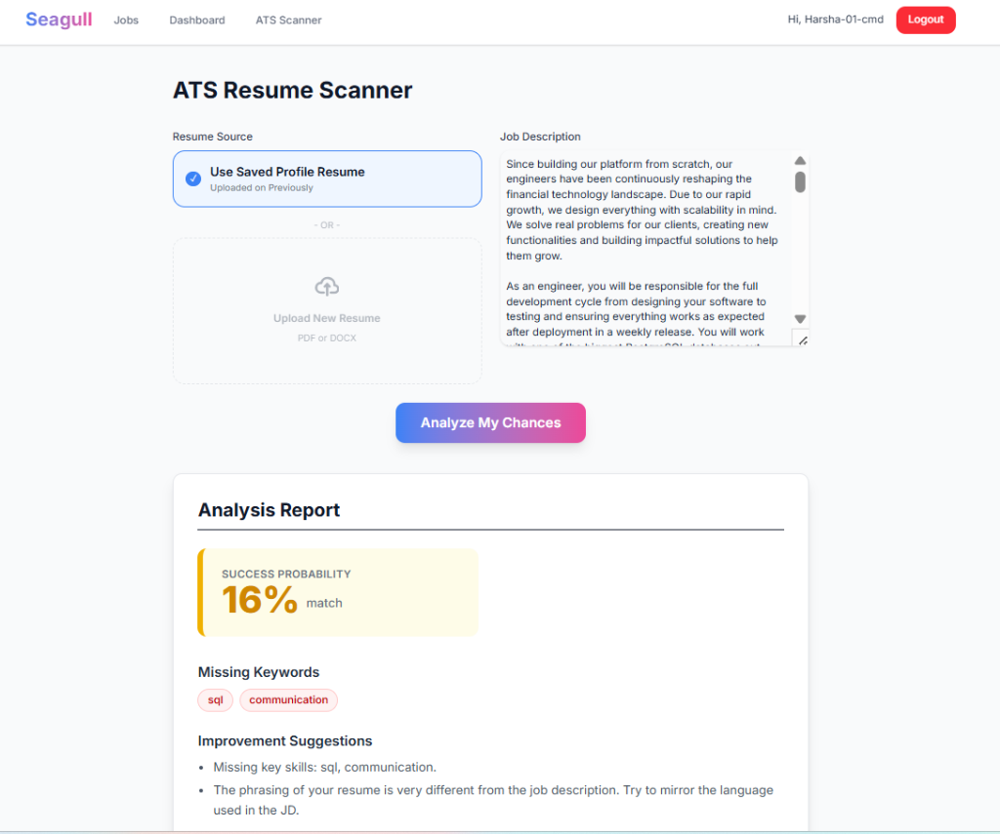

# 🦅 Seagull - AI-Powered Job Portal

<div align="center">


[](https://seagull-tau.vercel.app)
[](LICENSE)
[](https://typescriptlang.org)
[](https://nextjs.org)
[](https://python.org)

**An intelligent job search platform with AI-powered resume analysis and ATS scoring**

[Live Demo](https://seagull-tau.vercel.app) • [Features](#-features) • [Tech Stack](#-tech-stack) • [Installation](#-installation)

</div>

---

## ✨ Features

### 🔍 Smart Job Aggregation
- Real-time job scraping from multiple sources
- Intelligent caching with Redis for fast loading
- Filter and search functionality

### 📄 AI Resume Analysis (ATS Scanner)
- **TF-IDF Cosine Similarity** for job-resume matching
- **SpaCy NLP** for skill extraction and named entity recognition
- Get your ATS compatibility score instantly
- Actionable suggestions to improve your resume

### 👤 User Dashboard
- GitHub OAuth authentication
- Track your job applications
- Save your resume to your profile
- View application status history

### 🚀 Modern Architecture
- **Microservices**: Separate Client, Server, and AI Worker
- **Fully Dockerized**: One command to run everything
- **Production Ready**: Deployed on Vercel + Render

---

## 📸 Screenshots

### 🏠 Homepage


### 💼 Jobs Feed


### 📊 Dashboard


### 🔍 ATS Resume Scanner


---

## 🛠 Tech Stack

### Frontend
- **Next.js 14** - React framework with App Router
- **TypeScript** - Type-safe JavaScript
- **Tailwind CSS** - Utility-first styling
- **Axios** - HTTP client

### Backend
- **Node.js + Express** - REST API server
- **TypeScript** - Type-safe backend
- **MongoDB** - Document database
- **Redis** - Caching & sessions
- **Passport.js** - GitHub OAuth

### AI Worker
- **Python + FastAPI** - High-performance API
- **SpaCy** - NLP & Named Entity Recognition
- **Scikit-learn** - TF-IDF & Cosine Similarity
- **BeautifulSoup** - Web scraping

### DevOps
- **Docker & Docker Compose** - Containerization
- **Vercel** - Frontend hosting
- **Render** - Backend & Worker hosting
- **MongoDB Atlas** - Cloud database
- **Upstash** - Serverless Redis

---

## 📦 Installation

### Prerequisites
- Node.js 18+
- Python 3.9+
- Docker & Docker Compose
- MongoDB (local or Atlas)
- Redis (local or Upstash)

### Quick Start with Docker

```bash
# Clone the repository
git clone https://github.com/Harsha-01-cmd/Seagull.git
cd Seagull

# Create environment files
cp server/.env.example server/.env
# Edit server/.env with your credentials

# Run everything
docker-compose up --build
```

### Manual Setup

<details>
<summary>Click to expand</summary>

#### 1. Server
```bash
cd server
npm install
npm run dev
```

#### 2. Worker
```bash
cd worker
pip install -r requirements.txt
python -m spacy download en_core_web_sm
uvicorn main:app --reload --port 8000
```

#### 3. Client
```bash
cd client
npm install
npm run dev
```

</details>

---

## 🔧 Environment Variables

### Server (.env)
```env
MONGO_URI=mongodb+srv://...
REDIS_URL=rediss://...
GITHUB_CLIENT_ID=your_client_id
GITHUB_CLIENT_SECRET=your_client_secret
CLIENT_URL=http://localhost:3000
SERVER_URL=http://localhost:5000
NODE_ENV=production
```

### Client (Vercel Environment)
```env
NEXT_PUBLIC_API_URL=https://your-server.onrender.com
NEXT_PUBLIC_WORKER_URL=https://your-worker.onrender.com
```

---

## 🚀 Deployment

| Service | Platform | URL |
|---------|----------|-----|
| Frontend | Vercel | [seagull-tau.vercel.app](https://seagull-tau.vercel.app) |
| Backend | Render | seagull-7r21.onrender.com |
| Worker | Render | seagull-worker.onrender.com |
| Database | MongoDB Atlas | Cloud |
| Cache | Upstash Redis | Cloud |

---

## 📁 Project Structure

```
Seagull/
├── client/                 # Next.js frontend
│   ├── app/               # App router pages
│   ├── components/        # React components
│   └── lib/               # Utilities
├── server/                 # Express backend
│   ├── models/            # MongoDB schemas
│   ├── routes/            # API routes
│   └── index.ts           # Entry point
├── worker/                 # Python AI service
│   ├── main.py            # FastAPI app
│   └── scraper.py         # Job scraper
└── docker-compose.yml      # Container orchestration
```

---

## 🤝 Contributing

Contributions are welcome! Please feel free to submit a Pull Request.

1. Fork the repository
2. Create your feature branch (`git checkout -b feature/AmazingFeature`)
3. Commit your changes (`git commit -m 'Add some AmazingFeature'`)
4. Push to the branch (`git push origin feature/AmazingFeature`)
5. Open a Pull Request

---

## 📄 License

This project is licensed under the MIT License - see the [LICENSE](LICENSE) file for details.

---

## 👨‍💻 Author

**Harsha**

- GitHub: [@Harsha-01-cmd](https://github.com/Harsha-01-cmd)

---

<div align="center">

Made with ❤️ and ☕

⭐ Star this repo if you found it helpful!

</div>
